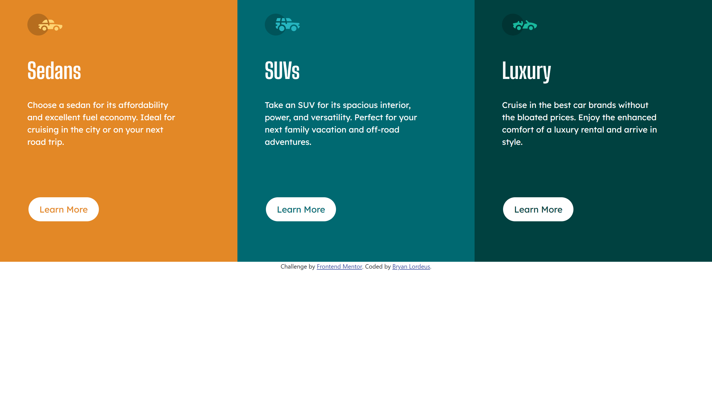

# Frontend Mentor - 3-column preview card component solution

This is a solution to the [3-column preview card component challenge on Frontend Mentor](https://www.frontendmentor.io/challenges/3column-preview-card-component-pH92eAR2-). Frontend Mentor challenges help you improve your coding skills by building realistic projects.

## Table of contents

* [Overview](#overview)
    * [The challenge](#the-challenge)
    * [Screenshot](#screenshot)
    * [Links](#links)
* [My process](#my-process)
    * [Built with](#built-with)
    * [Useful resources](#useful-resources)
* [Author](#author)

## Overview

### The challenge

Users should be able to:

* View the optimal layout depending on their device's screen size
* See hover states for interactive elements

### Screenshot

 

### Links

* Solution URL: [Add solution URL here](https://your-solution-url.com)
* Live Site URL: [Add live site URL here](https://your-live-site-url.com)

## My process

### Built with

* Semantic HTML5 markup
* Bootstrap
* Flexbox
* Mobile-first workflow

### Useful resources

* [Bootstrap](https://getbootstrap.com/) \- This website served as a reference to better implement all the features of Bootstrap for the project\.

## Author

* Frontend Mentor - [@yourusername](https://www.frontendmentor.io/profile/blordeus)
* Twitter - [@yourusername](https://www.twitter.com/blordeus)